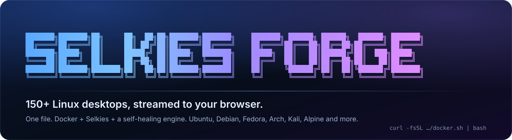
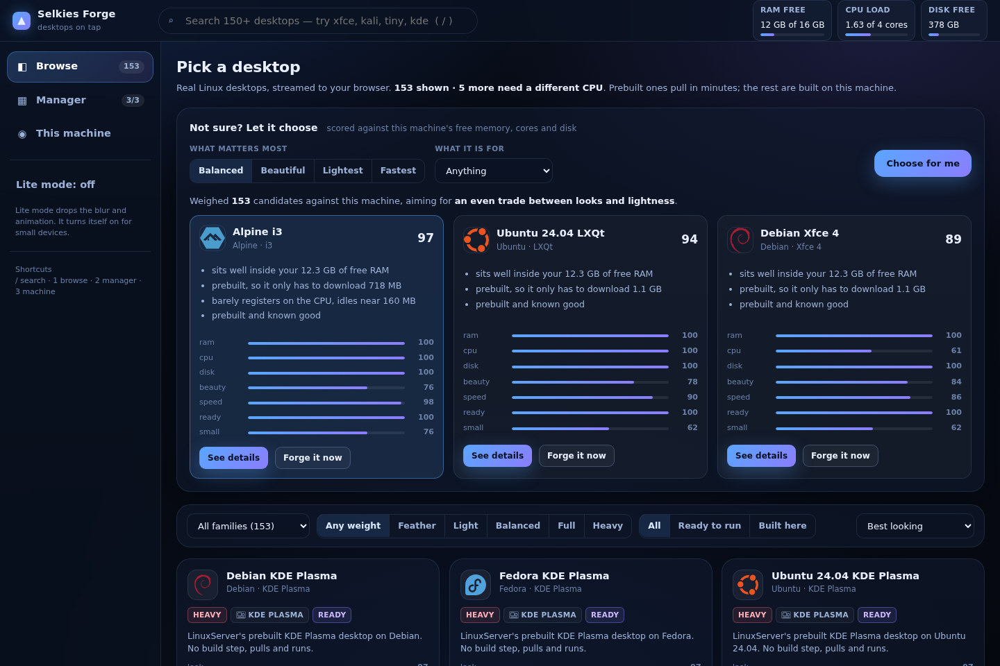
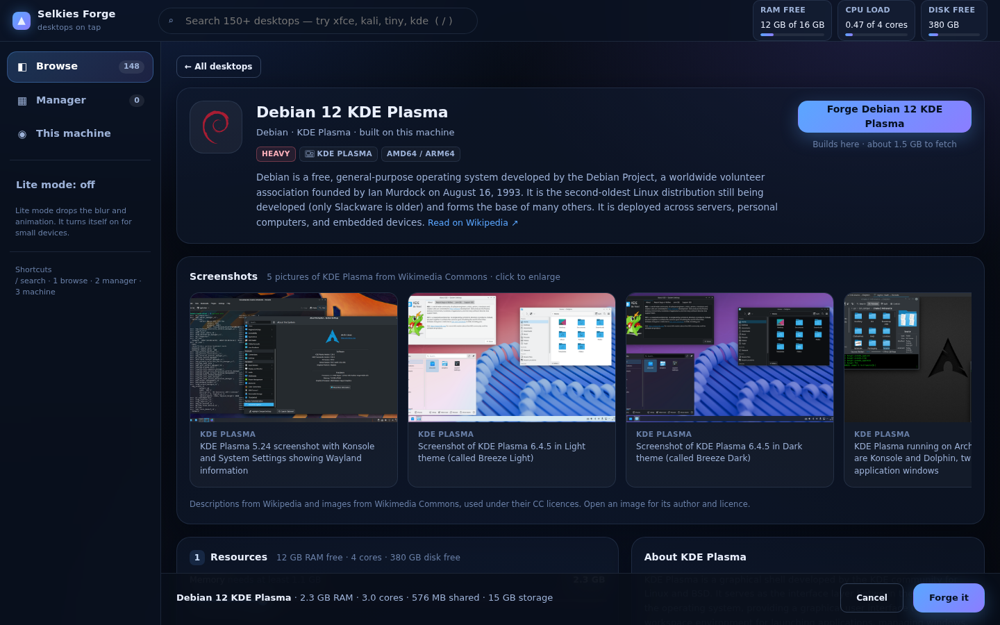
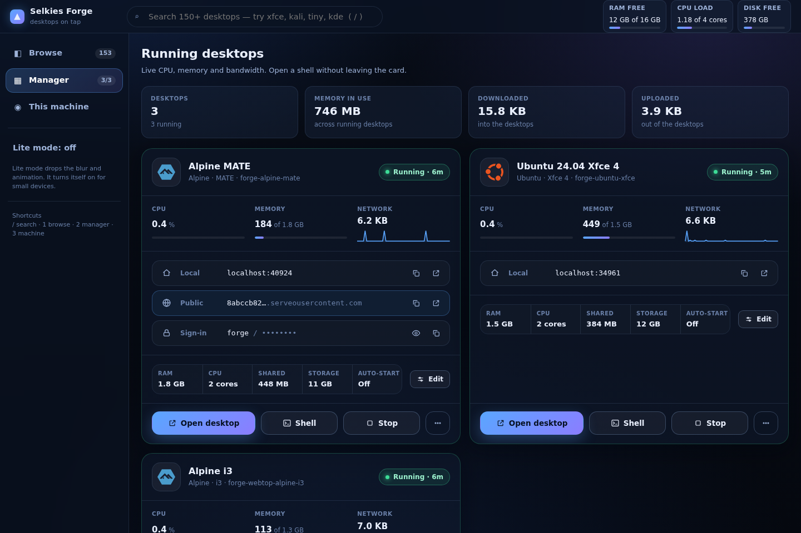
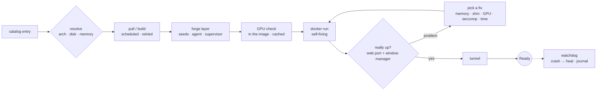

<p align="center">
  
</p>

<p align="center">
  <a href="LICENSE"></a>
  
  
  
  
</p>

<p align="center">
  <b><a href="#-quick-start">Quick start</a></b> ·
  <b><a href="#-what-you-get">What you get</a></b> ·
  <b><a href="#-the-engine">The engine</a></b> ·
  <b><a href="#-the-catalog">The catalog</a></b> ·
  <b><a href="#-documentation">Docs</a></b> ·
  <b><a href="#-build-it-yourself">Build it yourself</a></b> ·
  <b><a href="#-its-yours">It's yours</a></b>
</p>

---

**Selkies Forge** turns any Linux machine, even a Raspberry Pi, into a launch pad for full Linux desktops that run in your browser. Pick Ubuntu with Xfce, Fedora with KDE, Kali, Arch with i3, a Mac-like or Windows-like look, or any of 153 others. It downloads or builds the desktop, starts it in Docker, checks that it really works, and hands you a link. It's one file, and there's nothing to configure.

```bash
curl -fsSL https://raw.githubusercontent.com/adatskov-wcpss/animated-fiesta/main/docker.sh | bash
```

## ⚡ Quick start

<table>
<tr>
<td width="50%" valign="top">

**1 · Run it.** The line above checks for Python and Docker, offers to install them, unpacks the engine, and installs the `selkies-cli` command.

**2 · Pick a desktop.** In the web UI (`selkies-cli start`), or right in the terminal. *Let it choose* scores the catalog against your free memory, cores and disk.

**3 · Open the link.** A real Linux desktop in a browser tab, locally or anywhere through a public link.

**Coming back later?** Just type:

```bash
selkies-cli
```

</td>
<td width="50%" valign="top">

```bash
# straight to the web UI
curl -fsSL …/docker.sh | bash -s -- --webui

# one desktop, no questions
bash docker.sh --launch noble-xfce

# what's running, what to do next
selkies-cli

# start the web UI on boot
selkies-cli boot on

# what happened: crashes, heals, repairs
selkies-cli events

# back up a desktop, or clone it
selkies-cli backup forge-noble-xfce
selkies-cli clone forge-noble-xfce work
```

</td>
</tr>
</table>

> [!TIP]
> Works on **x86_64 and arm64**, including a **Raspberry Pi 4/5**: 148 of the 153 desktops have arm64 images. Needs a Linux machine with apt, dnf, yum, pacman, apk or zypper, and about 1–2.5 GB of free memory per desktop. [Requirements →](docs/getting-started.md#what-you-need)

## ✨ What you get

<p align="center"></p>

<table>
<tr>
<td width="33%" valign="top">

### 🖥️ 153 desktops
Ready-made LinuxServer Webtops and Kasm Workspaces. Every desktop environment from KDE Plasma to twm, on Ubuntu, Debian, Kali, Fedora, Arch and Alpine. Plus curated looks: **Aurora**, **Spearmint**, **Cupertino Clean**, **Dragonfire**, **Ricer i3**, **Featherweight**…

</td>
<td width="33%" valign="top">

### 🧠 A smart chooser
*Let it choose* scores every desktop against this machine and a taste (*balanced, beautiful, lightest, fastest*), plans memory, CPU, shared memory and storage for it, and explains why.

</td>
<td width="33%" valign="top">

### 🔴 Live everything
Watch the `docker pull` byte by byte and the build package by package. CPU, memory and bandwidth per desktop, live. A real terminal into any desktop, right inside its card.

</td>
</tr>
<tr>
<td valign="top">

### 🛡️ It really works
A launch only counts when a window manager is up and stays up. No wizards falling off the screen, no "Oh no! Something has gone wrong", no black desktops. Problems are fixed and retried, out loud.

</td>
<td valign="top">

### 🩹 Self-healing
Desktops that crash are restarted (and logged). Daemon blips are retried. A crash loop gets a rescue session that shows you the log. Any launch can be cancelled cleanly.

</td>
<td valign="top">

### 🌍 Share a link
A public https link through serveo, and optional sign-in in front of any desktop.

</td>
</tr>
</table>

<details>
<summary><b>More screenshots</b>: a desktop's page and the manager</summary>
<br>

<p align="center"></p>
<p align="center"></p>

</details>

### `selkies-cli`: it knows what's going on

<p align="center"></p>

Before it asks you anything, `selkies-cli` works out whether the web UI is up, **how it last stopped** (you, a reboot, a shutdown, a crash, a power cut, the OOM killer), which desktops were running before, and whether it starts on boot. Then it suggests what you most likely want. [All commands →](docs/cli.md)

## 🧩 The engine

The engine is the heart of the project: about 8,000 lines of standard-library Python, split into 31 focused modules.



| | |
|---|---|
| **Health that means something** | The web port answering isn't enough. An agent inside every desktop reports its window manager and screen, and the engine waits for one that stays up. |
| **GPU Smart Passthrough** | Finds any GPU (Intel, AMD, NVIDIA, Raspberry Pi, Mali, Adreno, virtual), proves inside the desktop's own image that it draws and encodes, hands over one render node with settings pinned, and steps back to software by itself. On by default. [How it works](docs/gpu.md) |
| **Automatic fixes** | Out of memory, more memory. Blocked syscalls, a relaxed seccomp profile. Out of `/dev/shm`, double it. A slow boot, more patience. Ports, names and quotas fix themselves in `docker run`. Every fix is logged. |
| **Never flattens the machine** | One build, two pulls and two boots at a time, enforced across every process. A desktop the machine can't hold is refused up front, with the reason. |
| **Cancel anything** | Kills the download or build (and its children) and removes the half-made desktop. Nothing is left behind. |
| **Watchdog** | Crashes are detected, journalled and healed (up to 3×/hour), and never confused with *you* stopping a desktop. |
| **The forge layer** | A few kilobytes inside every desktop: no first-run wizards, windows kept on screen, a crash supervisor with a rescue session, and fixes for Cinnamon, GNOME Flashback, KDE, Arch's D-Bus, glycin icons and more. |
| **Screens that fit** | Desktops follow your browser window. On phones, Retina laptops and 4K screens they run at 96 DPI and about 1920 wide, scaled to the screen and decided in your browser, so panels and text fit and nothing lands off the edge. Desktops that misdraw on resize run at a locked 1920×1080. |
| **Event journal** | `created → ready → crashed → healed → repaired`, per desktop, in the CLI, the UI and the API. |
| **Crash-safe jobs** | Every launch keeps a state file. Launches from the terminal show up (and cancel) in the web UI; a launch whose process died is spotted and its half-made desktop removed. |
| **Memory booking** | Two desktops starting at once must both fit: launches in flight book their memory, and admission counts it. |
| **Knows who's watching** | Counts the browser tabs on each desktop. Stops desktops nobody has watched for a while (if you want), restarts ones that freeze, and warns before the machine runs out of memory. |
| **Backups and clones** | Back up a desktop's files, restore them (with a safety copy first), or clone it into a second desktop, even from a backup after the original is gone. |
| **Dry runs** | `launch --dry-run` shows what would be downloaded, built and run, without doing it. |

Read the full tour: **[The engine](docs/engine.md)** · **[The forge layer](docs/forge-layer.md)** · **[HTTP API](docs/api.md)**

## 📚 The catalog

| Kind | Count | How it starts |
|---|---:|---|
| LinuxServer **Webtop** images | 19 | Prebuilt, only downloads |
| **Kasm** Workspaces images | 20 | Prebuilt (5 are x86_64 only) |
| **Distro × desktop** combinations | 100 | Built on your machine: Ubuntu 24.04, Debian 12, Kali, Fedora 42, Arch or Alpine 3.21, with Xfce, MATE, KDE, LXQt, LXDE, Cinnamon, Budgie, GNOME Flashback, Enlightenment, UKUI, i3, bspwm, awesome, Openbox, Fluxbox, IceWM, xmonad, dwm, Window Maker, FVWM3 and more |
| **Curated looks** | 14 | Built and themed: Zorin-, Mint-, Pop-, elementary-, Garuda- and Parrot-flavoured, Mac-like, Windows-like, tiling rices, a dev workbench, the smallest desktop there is |

Every desktop with its ID, RAM, download, screen mode and architectures: **[the full catalog →](docs/catalog.md)**

## 📖 Documentation

Everything lives in **[`docs/`](docs/README.md)**:

| Using it | How it works | Changing it |
|---|---|---|
| [Getting started](docs/getting-started.md) | [The engine](docs/engine.md) | [Building from source](docs/building.md) |
| [`selkies-cli`](docs/cli.md) | [The forge layer](docs/forge-layer.md) | [Contributing](CONTRIBUTING.md) |
| [The web UI](docs/web-ui.md) | [HTTP API](docs/api.md) | [The catalog](docs/catalog.md) |
| [Day to day](docs/operations.md): boot, updates, restore, disk | [Security](docs/security.md) | [Configuration](docs/configuration.md) |
| [Troubleshooting](docs/troubleshooting.md) · [FAQ](docs/faq.md) | | |

## 🔧 Build it yourself

`docker.sh` is generated. Its source is in **[`.source/`](.source/)**: readable, separate files, with the engine as a Python package, the web UI, the shell front end and the tests. Change anything, then compile:

```bash
python3 .source/build.py     # or: bash .source/build.sh
```

The builder **asks where to write `docker.sh`** (press Enter for the repository's own). Before writing a byte, it checks:
- every Python, JavaScript, JSON and shell file
- the startup scripts of all 114 built desktops
- that the payload unpacks byte for byte and runs
- the unit tests

It needs only Python 3 and bash. The full guide, including how to add your own desktop or distro, is in **[docs/building.md](docs/building.md)**.

## 💙 It's yours

> [!IMPORTANT]
> **Selkies Forge is open source under the [MIT licence](LICENSE).** You're free to use it, change it, fork it, rename it, strip it down, build on it, ship it, commercially or not. You don't need to ask anyone. If you modify the project, you're free to do that however you like. Contributions back are welcome ([how](CONTRIBUTING.md)) but never expected.

## 🔒 Good to know

- The web UI listens on **localhost only**. `--expose` opens it to your network with **no access control**, and refuses cross-site requests either way. [Security →](docs/security.md)
- **Desktops only start when you start them** (unless you turn on auto-start for one). After a reboot, the forge offers to bring back the ones that were running.
- **Your files** live in each desktop's `/config` volume. They survive restarts, limit changes and repairs.
- **Updates** arrive by `git fetch`, fast-forward only, and never go backwards. `FORGE_AUTO_UPDATE=0` turns them off.
- **No telemetry**, no accounts, no analytics.

## 🙏 Credits

- [LinuxServer.io](https://www.linuxserver.io/) for `baseimage-selkies` and the Webtop images, and the [Selkies](https://github.com/selkies-project/selkies) project for the streaming
- [Kasm Technologies](https://www.kasmweb.com/) for the Kasm Workspaces images
- [Simple Icons](https://simpleicons.org/) for the distro logos (CC0); the trademarks belong to their owners
- [Wikipedia](https://en.wikipedia.org/) (CC BY-SA 4.0) and [Wikimedia Commons](https://commons.wikimedia.org/) for descriptions and pictures; each image is under its own licence, linked from the viewer
- [serveo](https://serveo.net) for the public links

<p align="center"><sub>Built on a Raspberry Pi. MIT licensed. Make it yours.</sub></p>
