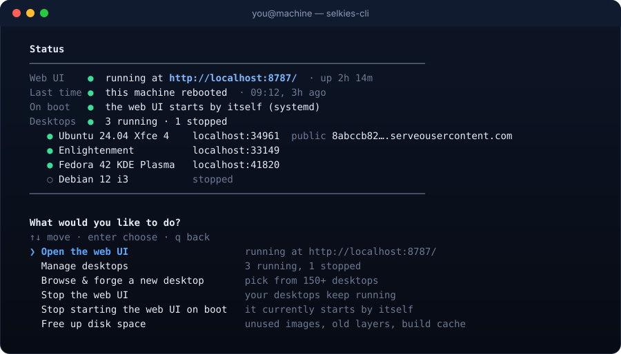

# The `selkies-cli` command

After the first run, `selkies-cli` brings everything back from any terminal. It's a small wrapper in `~/.local/bin` (or `~/bin`, or `/usr/local/bin`) that runs the front end unpacked in `~/.selkies-forge/app`.

<p align="center"></p>

## The home screen

Run `selkies-cli` with no arguments. Before it asks anything, it looks at what's going on and shows it:

| Line | What it tells you |
|---|---|
| **Web UI** | ● running (with its link and uptime), ! stopped unexpectedly (its process is gone or not answering), or ○ not running |
| **Stopped** / **Last time** | How the web UI last stopped: you, a restart, an update, a reboot, a shutdown, a crash, a power cut, or the OOM killer. See [how it tells](operations.md#how-did-it-stop-last-time). |
| **On boot** | Whether the web UI starts by itself at boot, and how (systemd user service or cron) |
| **Desktops** | How many are running and stopped, with each one's link and public link |

Then it suggests what to do next, most likely first. **Browse & forge a new desktop** is always the third choice. The rest depends on what it found:

| It finds | It suggests first |
|---|---|
| Nothing set up yet | Browse & forge your first desktop, start the web UI |
| Desktops that were running before a reboot or crash | **Start them again** (or *Forget about the last stop*) |
| The web UI running | Open it, manage desktops, browse, stop or restart it |
| The web UI stopped unexpectedly | Start it again, show why it stopped |
| Desktops but no web UI | Start the web UI, or manage desktops right here |
| Docker not answering | Find out why |

The menu works with ↑↓ and Enter. `q` goes back.

## Verbs

| Command | What it does |
|---|---|
| `selkies-cli` | The home screen |
| `selkies-cli status` | Print the status and exit |
| `selkies-cli start` | Start the web UI in the background |
| `selkies-cli stop` | Stop the web UI (your desktops keep running) |
| `selkies-cli restart` | Restart the web UI on the same address |
| `selkies-cli open` | Print the web UI's link, and open it if there's a browser. Offers to start it if it's down. |
| `selkies-cli manager` | Manage desktops in the terminal: links, shell, tunnel, limits, auto-start, restart, stop, logs, **what happened**, **repair**, remove |
| `selkies-cli new` | The hand-picked list of desktops |
| `selkies-cli list` | Every desktop with its ID, size and needs |
| `selkies-cli doctor` | Check Docker, memory, disk, quota support, serveo |
| `selkies-cli events` | The event journal: launches, crashes, heals, repairs, stops |
| `selkies-cli clean` | What the forge uses on disk, and options to free it |
| `selkies-cli boot on` / `boot off` / `boot` | Start the web UI by itself at boot, stop doing that, or show the setting |
| `selkies-cli restore` | Start the desktops that were running before the last reboot or crash |
| `selkies-cli update` | Get the latest version from GitHub now |
| `selkies-cli uninstall` | Remove everything the forge created, including the command |
| `selkies-cli help` | Usage |

## Flags

These work with `selkies-cli` and with `docker.sh` itself:

| Flag | What it does |
|---|---|
| `--webui`, `-w` | Straight to the web UI (asks background or foreground) |
| `--bg` / `--fg` | Web UI in the background, or held in the foreground until Ctrl-C |
| `--stop` | Stop a background web UI |
| `--restart`, `--status`, `--open`, `--update`, `--setup` | Same as the verbs |
| `--cli`, `-c` | Straight to the hand-picked list |
| `--smart`, `-s` | Let it choose for this machine |
| `--manager`, `-m` | Manage desktops |
| `--launch ID` | Forge one desktop and exit |
| `--list`, `-l` | Print the catalog |
| `--doctor` | Check this machine |
| `--port N` | Web UI port (default 8787, or the next free one) |
| `--bind ADDR` | Address the web UI listens on (default `127.0.0.1`) |
| `--expose` | Listen on all interfaces, behind a token (see [Security](security.md)) |
| `--no-tunnel` | No public serveo link |
| `--yes`, `-y` | Accept the install prompts for Python and Docker |
| `--extract-only DIR` | Unpack the engine and UI into `DIR` and stop: no installs, no checks |
| `--force-extract` | Re-unpack the app even if it's unchanged |
| `--version`, `-V` | Print the version |
| `--uninstall` | Remove everything |

## Forging from the terminal

`selkies-cli new` (or **Browse & forge** on the home screen) offers the hand-picked list, *Let it choose*, browsing by distro family, and search. After you pick, it shows the plan (memory, CPU, shared memory, storage) with this machine's free resources. You can change any of them and set a username and password. Then it streams the launch with a progress bar:

```
  ▰ READY  Ubuntu 24.04 LTS Xfce 4
  ──────────────────────────────────────────────────────────────────
  desktop      Xfwm4 is up  · screen fixed:1920x1080, scaled to fit
  public link  https://8abccb82….serveousercontent.com  · serveo http
  on this box  http://localhost:41820  · no tunnel needed
  container    forge-noble-xfce  · docker name
  memory       1536 MB  · hard cap
  ...
```

If a desktop starts but its session has a problem, it says **STARTED, WITH A PROBLEM**, quotes the desktop's own log, and lists any fixes it applied on the way. Ctrl-C during a launch cancels it cleanly: the download or build stops, and a half-made desktop is removed.

## The engine underneath

`selkies-cli` is a front end. The work happens in the engine, which you can call directly:

```bash
python3 ~/.selkies-forge/app/engine.py --help
```

| Command | What it does |
|---|---|
| `serve [--port N] [--bind A] [--tunnel]` | Run the web UI |
| `launch ID [--name N] [--memory MB] [--cpus N] [--shm MB] [--disk MB] [--user U --password P] [--display auto\|fit\|fixed] [--resolution WxH] [--no-tunnel] [--force] [--timeout S]` | Forge a desktop, streaming `P` (progress), `L` (log), `E` (error), `H` (hint) and `D` (result JSON) lines |
| `do NAME start\|stop\|restart\|remove\|tunnel\|untunnel\|repair [--purge]` | Act on a desktop |
| `retune NAME [--memory] [--cpus] [--shm] [--disk] [--autostart on\|off]` | Change limits (live, or by recreating) |
| `instances`, `stats`, `status` | The live view, as JSON |
| `list [--quick] [--runnable] [--family F] [--format json\|tsv]`, `info ID`, `dockerfile ID` | The catalog |
| `smart [--taste T] [--purpose P] [--family F] [--no-build]` | The chooser |
| `events [--name N] [--limit N] [--json]` | The event journal |
| `space [--clean [--all] [--volumes] [--dry-run]]` | Disk use, and clean-up |
| `watchdog [--once]` | Run the watchdog in the foreground, or one pass |
| `reconcile` | Forget records of desktops that no longer exist |
| `scheduler` | Build, pull and boot slots in use |
| `doctor`, `host` | Checks and facts about this machine |
| `boot status\|enable\|disable`, `last-stop`, `restore`, `check-update [--install]` | Lifecycle and updates |
| `logs NAME [--tail N]` | A desktop's container log |
