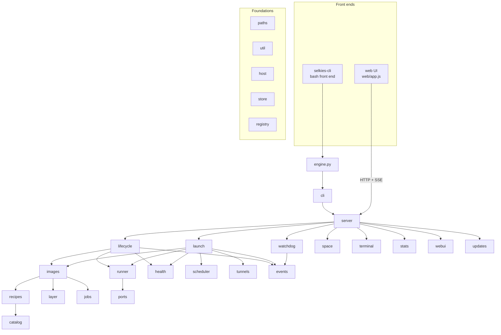
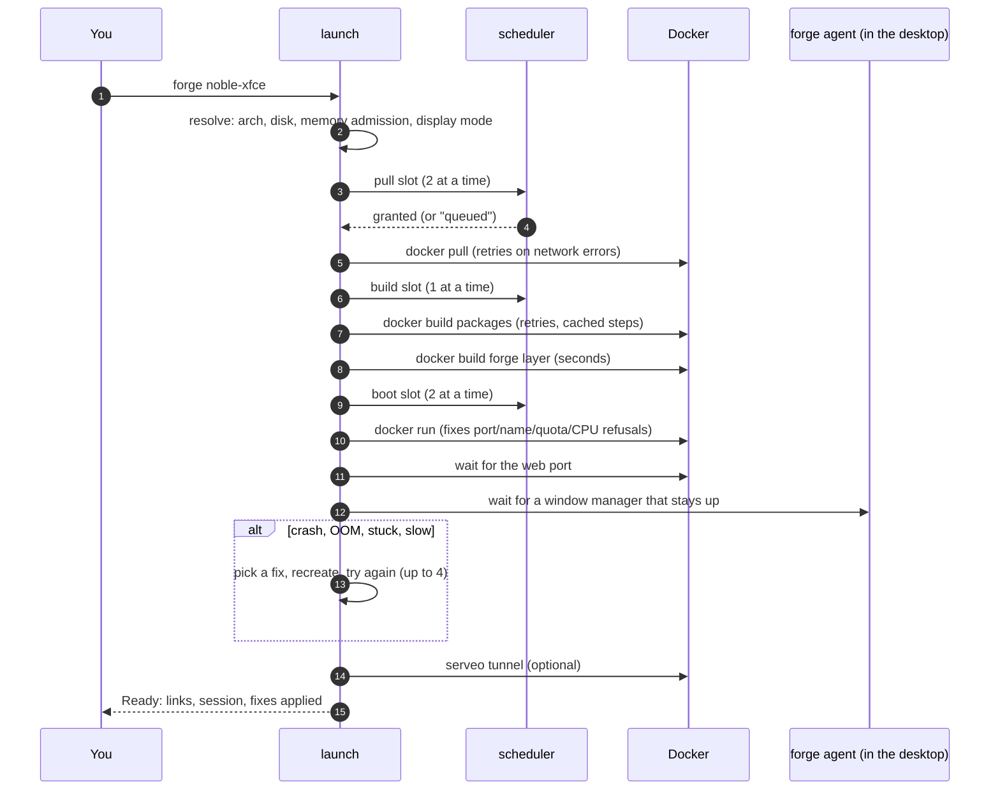
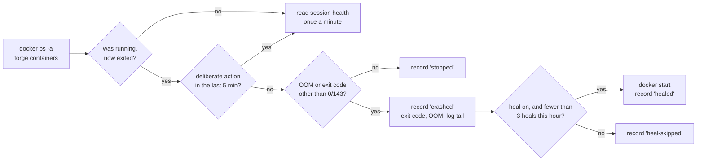

# The engine

The engine is the heart of Selkies Forge. Its job: take a catalog entry and turn it into a working Linux desktop in a browser tab, on a machine it knows nothing about in advance. Then it keeps that desktop working, and tells you the truth about what happened.

It's plain Python 3.8+ with only the standard library. It lives in `.source/src/forge/` as a package of focused modules, and `engine.py` is the command-line entry point. The web UI, `selkies-cli` and the HTTP API are all front ends to it.

## Design principles

1. **Done means working.** A launch only succeeds when a window manager is up and stays up, not when a web port answers.
2. **Fix ordinary failures, out loud.** A flaky network, a taken port, too little memory, a strict syscall filter, a slow first boot: each one is fixed and retried, and each fix is written to the log.
3. **Never flatten the machine.** Builds, pulls and first boots are rationed. A desktop the machine can't hold is refused up front, with the reason.
4. **Everything can be stopped.** Any launch can be cancelled at any stage, and leaves nothing behind.
5. **Remember what happened.** Every action and every crash goes into a journal. "You stopped it" and "it crashed" are never confused.
6. **Docker is the source of truth.** Containers carry labels that describe them. The engine's own files are notes that can always be rebuilt from Docker.

## The modules

| Module | Responsibility |
|---|---|
| `paths` | Where everything lives (`FORGE_HOME`, `app/`, `state/`, `logs/`) and shared constants: labels, prefixes, ports |
| `util` | JSON state files (atomic writes), cross-process `FileLock`, `run()` with Docker-daemon retries, formatting |
| `host` | What this machine is: architecture, memory, disk, Docker, storage driver, quota support, registry manifests |
| `catalog` | The 153 desktops: desktop environments × bases × package lists, webtops, Kasm images, curated looks |
| `smart` | The planner and chooser: memory, CPU, shm and storage for an entry on this host, and taste-based scoring |
| `info` | Wikipedia text and filtered Commons pictures for each entry, real screenshots, the public view of an entry |
| `recipes` | Install scripts, `startwm.sh` and Dockerfiles for built desktops |
| `layer` | The [forge layer](forge-layer.md): seeds, agent, supervisor, wallpaper, shims |
| `images` | `docker pull` with live progress, `docker build`, and building the forge layer on top |
| `scheduler` | Build, pull and boot slots: cross-process fcntl locks |
| `jobs` | Jobs: an event stream per operation, cancellation, process tracking, persistent logs |
| `runner` | `docker run` arguments, screen modes, and a `docker run` that fixes its own refusals |
| `health` | Is it really up: web port, session agent, OOM, crash loops; the auto-fix chooser |
| `launch` | The pipeline that ties it together |
| `lifecycle` | Start, stop, restart, remove, repair and reconfigure, each under a per-desktop lock |
| `events` | The append-only event journal |
| `watchdog` | Crash detection, healing, session health, housekeeping |
| `space` | Disk use by category, and safe clean-up |
| `ports`, `store`, `registry` | Port allocation, the engine's notes, and the live view of desktops from Docker |
| `tunnels` | serveo tunnels: open, check, close, reopen |
| `stats`, `terminal` | CPU, memory and bandwidth sampling; live PTY shells into desktops |
| `webui`, `updates`, `doctor`, `server`, `cli` | The web UI's lifecycle and boot setup, self-update, checks, HTTP API, command line |

Lower modules never import higher ones. The build checks that every module imports cleanly on its own.

## The launch pipeline

### 1. Resolve

- The entry's image must publish a build for this machine's architecture. The engine checks the registry manifest and suggests alternatives when it doesn't.
- There must be enough free disk for the download and the build.
- **Memory admission.** If free memory is below the desktop's floor (`ram_min`), the launch is refused before anything downloads. The message names the desktops that are using memory. `--force` overrides it. If free memory is only below the planned cap, the log says it'll run tight.
- **Screen mode.** *fit* (follow the browser window; the layer's [screen guard](forge-layer.md#the-screen-guard-4k-screens) scales it on 4K screens) or *fixed* (a set size and 96 DPI, locked, scaled to fit), from the entry or your choice.

### 2. Fetch

- **Pull** with a live per-layer progress bar (a PTY makes `docker pull` print byte counts). Network errors (TLS timeouts, resets, 5xx, rate limits) are retried four times with backoff, keeping finished layers. A tag that's gone from the registry fails at once, with a clear message.
- **Build** for distro × desktop entries: one Dockerfile that installs the packages with retries (`Acquire::Retries`, `dnf retries`, `apk update` loops). If the bulk install fails, it falls back to installing one package at a time, and then **verifies that the session binary exists**, failing with exit 97 if it doesn't. Network failures during a build are retried, and Docker's step cache means only the failed step reruns.
- Both take a **scheduler slot** first. If another launch already fetched the same image while this one was queued, nothing is fetched twice.

### 3. The forge layer

A few kilobytes on top of the desktop image, rebuilt in seconds whenever the forge changes. It's what makes desktops behave. See [The forge layer](forge-layer.md).

### 4. Start

`docker run` with:
- memory and swap pinned to the same cap (a desktop can't swap the host out)
- CPUs, `/dev/shm`, the storage quota where the storage driver supports one, and the `/config` volume
- labels describing everything (`io.selkiesforge.*`)
- the screen mode (`SELKIES_MANUAL_*` and a locked 96 DPI for fixed; [details](forge-layer.md#screen-modes)) and `MAX_RES=3840x2160` (Xvfb's default 15360×8640 screen is half a gigabyte of framebuffer)
- sign-in, timezone, PUID/PGID

The run fixes its own refusals: a port someone grabbed (new ports), a name in use (new name), a quota the storage driver refuses (tracked instead of enforced), a CPU count above the machine's (capped). Transient daemon errors are retried.

### 5. Health: is the desktop really up?

1. **The web port** must answer (HTTP, or 401/403 behind sign-in).
2. **The session.** The forge agent inside the desktop reports the window manager it sees (`_NET_SUPPORTING_WM_CHECK`) and the windows on screen. The engine wants a window manager on two looks in a row. Window managers that never announce themselves (twm, ratpoison, Window Maker) count once windows are on screen.

Problems are classified and handed to the fix chooser:

| Problem | How it's detected | Fix tried |
|---|---|---|
| `oom` | Docker's `OOMKilled`, or memory above 88% of the cap while the session fails | More memory, as far as the machine allows |
| `crash` | The agent reports rescue mode: three quick session exits in a row | seccomp unconfined, then keep the rescue session and warn |
| `nowm` | Web page up, but no window manager after 150–240 s | seccomp unconfined, then warn |
| `exited` | The container stopped during start | seccomp if the log shows a syscall block; otherwise restart once |
| shm | `shm_open` / `/dev/shm` / no space in the log | Double `/dev/shm` |
| `timeout` | The web port never answered | Wait 1.6× longer |

Each fix is applied at most once. The container is recreated with it, and the launch tries again (up to four attempts). If nothing fixes a session problem, the desktop is **left running with its rescue session**, which shows the session's own log inside the desktop, and the launch reports a warning rather than a bare error.

### 6. Tunnel

Optional. HTTP tunnels for Selkies desktops, TCP for Kasm (HTTPS inside). A tunnel failure never fails a launch; the local link still works.

## The scheduler

Heavy work is rationed by kind:

| Slot | Default | Variable |
|---|---|---|
| build | 1 | `FORGE_MAX_BUILDS` |
| pull | 2 | `FORGE_MAX_PULLS` |
| boot | 2 | `FORGE_MAX_BOOTS` |

Each slot is an `fcntl` lock file in `state/slots/`, so the limits hold across every process at once: the web UI, `selkies-cli`, a second web UI. A waiting job shows **queued** with the reason, and can be cancelled while it waits. The kernel releases a lock when its process dies, so a crash never leaves a slot stuck. `engine.py scheduler` and `GET /api/scheduler` show what's in use.

## Jobs and cancellation

Every launch is a `Job`: a thread doing the work, plus an ordered event stream (`log`, `phase`, `progress`, `done`, `error`). The web UI reads it over Server-Sent Events, and the CLI reads it as `P`/`L`/`E`/`D` lines.

- Every subprocess a job starts runs in its **own process group**, registered with the job. **Cancelling** sends SIGTERM to each whole group (SIGKILL four seconds later if needed), and the pipeline stops at its next checkpoint. Checkpoints sit between stages, inside the health waits, and between `docker run` retries.
- A cancelled launch **removes the half-made container and its empty volume**, releases its ports, and records `launch-cancelled`.
- Every job writes its log to `logs/jobs/<time>-<id>.log` (the newest 60 are kept), so a failure can be read after the web UI restarts.

## Per-desktop locks

Every lifecycle action (start, stop, restart, remove, repair, recreate, limit changes) holds `state/inst-<name>.lock`. A stop from the terminal and a repair from the browser therefore run one after the other, never over each other. The action is written to the journal **before** it runs. That's how the watchdog knows a container that just exited was stopped on purpose.

## The event journal

`state/events.jsonl`: one JSON object per line (`ts`, `name`, `event`, `detail`, plus fields like `exit_code` and `oom`). It's trimmed to the newest 4,000 lines once it passes 2 MB.

| Event | Meaning |
|---|---|
| `create`, `ready` | A launch created the container; it came up (with fixes, if any) |
| `recreate` | An auto-fix recreated it |
| `launch-failed`, `launch-cancelled` | A launch ended without a desktop |
| `start`, `stop`, `restart`, `remove`, `repair`, `retune` | You (or the UI) asked for it |
| `crashed` | It exited while running, without being asked: exit code, OOM flag, last log lines |
| `healed`, `heal-skipped`, `heal-failed` | The watchdog restarted it, or decided not to |
| `session-rescue` | Its session kept crashing; a rescue session is showing why |
| `stopped` | It exited cleanly but outside the forge (`docker stop` by hand) |

See it with `selkies-cli events`, in each desktop's **Logs** in the manager, or with `GET /api/events`.

## The watchdog

While the web UI runs, one pass every 15 seconds:

- **Healing** is on by default. Turn it off per desktop with the label `io.selkiesforge.heal=off`, or for everything with `FORGE_HEAL=0`. Only a crash while the forge is watching counts. A reboot, or a desktop you stopped, is never "healed" back on.
- **Session health** (window manager, screen size, rescue mode) is cached per desktop and shown on its manager card.
- **Housekeeping** every 10 minutes: registry entries and port reservations for containers that no longer exist are dropped. This also runs once when the web UI starts.

## Docker resilience

Read-only Docker commands (`inspect`, `ps`, `images`, `stats`, `logs`, `info`…) are retried (after 1 s, 2 s, then 4 s) when the *daemon itself* is briefly unreachable: restarting, overloaded, a socket reset. A real error about the thing you asked for is returned at once. Commands that change something are never repeated behind your back.

## State files

| File | What |
|---|---|
| `state/instances.json` | Notes per desktop (plan, options without passwords, image, ports, tunnel) |
| `state/ports.json` | Short-lived port reservations (15 min), so two launches never pick the same port |
| `state/events.jsonl` | The event journal |
| `state/slots/*.lock` | Scheduler slots |
| `state/server.json`, `webui-life.json`, `last-stop.json` | The web UI's address, heartbeat and how it last stopped |
| `state/boot.json`, `update.json`, `cache.json` | The boot setting, update checks, cached manifests and host facts |
| `logs/jobs/*.log` | One per launch |

All JSON is written atomically (a temp file, `fsync`, then rename) and guarded by named locks.

## Extending the engine

- **A new desktop or distro:** see [Building from source](building.md#adding-a-desktop-or-a-distro).
- **A new auto-fix:** add a pattern and a branch to `health.pick_fix`, then a unit test in `.source/tests/test_health.py`.
- **A new API endpoint:** `server.Handler._api_get` / `_api_post`. Document it in [api.md](api.md).
- **A new first-run fix inside desktops:** `layer.SEED` (runs as root before the desktop starts) or `layer.PRESESSION` (runs inside the session's D-Bus).
